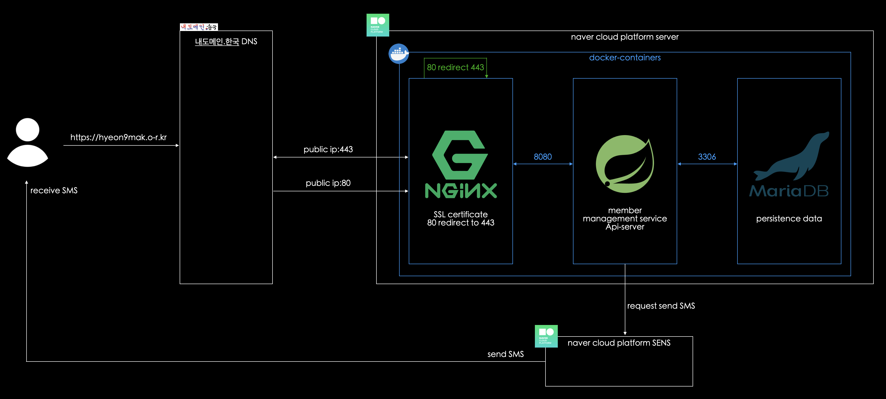
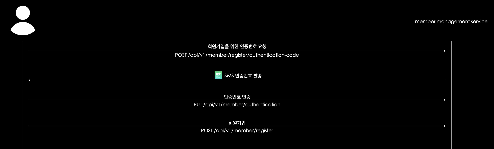
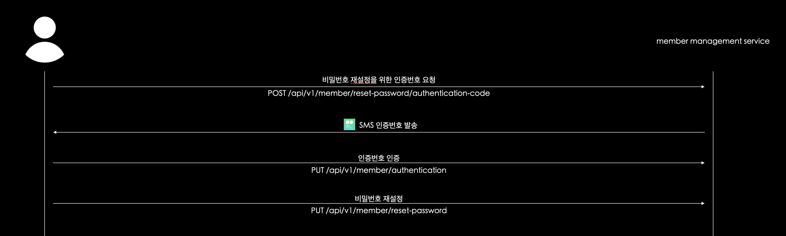
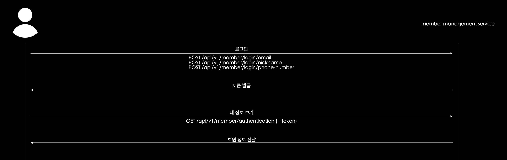

# 회원 관리 서비스 (https://hyeon9mak.o-r.kr/swagger-ui/index.html)

## 프로젝트 구조

- 최대한 저렴하게 구성하기 위해 naver cloud platform server 1대 사용



### 회원가입 flow



### 비밀번호 재설정 flow



### 로그인, 내 정보 보기 flow



<br>

## 로컬 실행 방법

1. `/docker/docker-compose.yml` 를 이용하여 컨테이너에 mariadb 를 띄운다.
```
$ docker-compose up -d member-management-service-mariadb
```

2. gradle 빌드를 진행한다.

```
$ ./gradlew clean build
```

3. `/dockerDockerfile`를 이용해 `/build/libs/member-management-service.jar`를 이미지화 한다.

```
$ docker build -t member-management-service-app:0.0.1 -f docker/Dockerfile . 
```

4. 환경변수 주입과 동시에 `member-management-service` 이미지를 컨테이너에 띄운다.

```
$ docker run -p 8080:8080 --network docker_member-management-service-network -e PROFILE=local -e NAVER_CLOUD_API_ACCESS_KEY={NCP API ACCESS KEY} -e NAVER_CLOUD_API_SECRET_KEY={NCP API ACCESS KEY} -e NAVER_CLOUD_SENS_API_SERVICE_ID={NCP SENS API SERVICE ID} -e NAVER_CLOUD_SENS_API_MESSAGE_FROM={SMS SENDER NUMBER} member-management-service-app:0.0.1
```

<br>

## 특징, FAQ

- `MemberAuthenticationCodeRepository.findLastOneByPhoneNumber` 명칭과 실제 쿼리가 다름(MySQL 에는 `Last` 예약어가 없음)
- `LastOne` 이라는 가독성을 포기하고 싶지 않아 QueryDSL 을 적용.
  - `MemberAuthenticationCodeRepository` 에 확장함수를 구현하는 것으로 간단하게 대체 가능했을듯...
- FeignClient 를 이용하여 NAVERCLOUD SENS API 를 호출. SMS 전송 가능.
- `Member` 도메인과 외부 의존을 최대한 분리하고자 했음.
  - `Member` DomainEntpty 가 JPA Entity 로서의 역할도 완전히 가능할 정도로 강결합되어 있음. 
  - DomainEntity 와 JPAEntity 를 온전히 분리할까 하다가 이미 Web, Service 계층도 Spring 어노테이션에 점철되어 있는걸 보고 포기.
  - value class 를 활용한 덕분에 `@Embedded` , `@Embeddable` 어노테이션이 필요 없음
- CORS?
  - protocol(http), host(hyeon9mak.o-r.kr), port(443) 으로만 자원을 제공하므로 CORS 문제는 따로 핸들링할 필요가 없었음!
- 이벤트 기반
  - 크게 적용할 부분이 안보였음...
- 멀티모듈
  - 도메인 모듈을 정말 순수하게 두기 위해 나눌까 하다가, 오히려 유지보수가 어려워질거 같아서 단일 모듈로 둠.

## 회원 정보

- 이메일
  - [x] 이메일 ID는 `알파벳 대소문자`, `숫자`, `.`, `_`, `-` 만 가능하다.
  - [x] 이메일 도메인은 `알파벳 대소문자`, `숫자`, `.`, `-` 만 가능하다.
  - [x] 이메일 최상위 도메인은 `2~6 자 사이의 알파벳 대소문자`만 가능하다.
- 닉네임
  - [x] 닉네임은 `알파벳 대소문자`, `숫자`, `한글` 로만 이루어질 수 있다.
  - [x] 닉네임은 `2~10 자 사이`여야 한다.
- 비밀번호
  - [x] 비밀번호는 `알파벳 대소문자`, `숫자`, `특수문자` 로 이루어질 수 있다.
  - [x] 비밀번호는 `8~20 자 사이`여야 한다.
  - [x] 비밀번호는 `숫자`, `알파벳 대소문자`, `특수문자` 3 가지를 모두 포함해야 한다.
- 이름
  - [x] 이름은 `알파벳 대소문자`, `한글`, `중간 공백` 으로만 이루어질 수 있다. 
  - [x] 이름은 `2~100 자 사이`여야 한다.
- 전화번호
  - [x] 전화번호는 `숫자` 로만 이루어질 수 있다.
  - [x] 전화번호는 `숫자 10~11 자 사이`여야 한다.

## 회원 기능

- [x] 회원가입
  - [x] 이미 중복된 이메일이 존재하면 회원가입을 할 수 없다.
  - [x] 이미 중복된 닉네임이 존재하면 회원가입을 할 수 없다.
  - [x] 이미 중복된 전화번호가 존재하면 회원가입을 할 수 없다.
  - [x] 전화번호 인증 필요
- [x] 로그인
  - [x] 이메일 + 비밀번호
  - [x] 닉네임 + 비밀번호
  - [x] 전화번호 + 비밀번호
- [x] 내 정보 보기 기능
  - [x] 로그인 필요
  - [x] 나의 정보만 볼 수 있음
- [x] 비밀번호 찾기 (재설정)
  - [x] 전화번호 인증 필요
